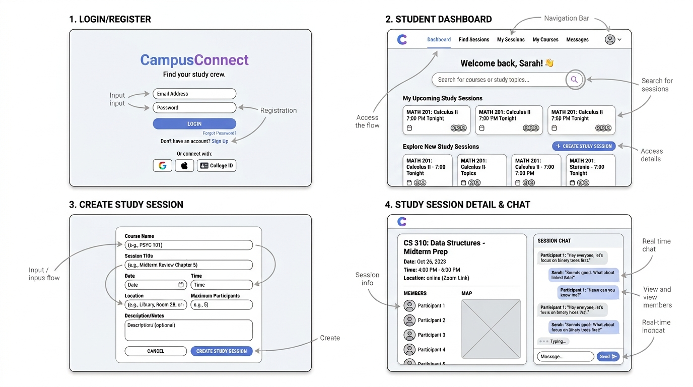

# CampusConnect

[My Notes](notes.md)

CampusConnect is an online app meant to aid college students in finding study partners and arranging study sessions. Students can build their profiles, join study groups according to the subjects they have, arrange study sessions, and engage in chatting with other participants.

> [!NOTE]
> This is a template for your startup application. You must modify this `README.md` file for each phase of your development. You only need to fill in the section for each deliverable when that deliverable is submitted in Canvas. Without completing the section for a deliverable, the TA will not know what to look for when grading your submission. Feel free to add additional information to each deliverable description, but make sure you at least have the list of rubric items and a description of what you did for each item.

> [!NOTE]
> If you are not familiar with Markdown then you should review the [documentation](https://docs.github.com/en/get-started/writing-on-github/getting-started-with-writing-and-formatting-on-github/basic-writing-and-formatting-syntax) before continuing.

### Elevator pitch

CampusConnect is a web app that lets college students connect with study partners and arrange study groups. Students are able to create their own profiles, connect with other students who are taking the same classes, create or join study groups, and communicate using real-time chat. CampusConnect combines study groups and communication into one app.

### Design



<!-- ```mermaid
sequenceDiagram
    actor You
    actor Website
    You->>Website: Replace this with your design
``` -->

### Key features

- User Account — Users can create an account and log into the system.
- User Profile — The user has the ability to add personal information like major and class.
- Study Session — Students can create study sessions with course, date, time, location, and number of participants.
- Find Study Partner — Students can look up study sessions along with other students taking similar classes.
- Join Study Session — User can join open study groups.
- Chat — Real-time chat allows members of the study group to communicate.
- Study Location — Third-party location/map will be used in the app for details about study location.
- Real-Time Notification — Users can get notifications whenever a new member joins the study session or sends a message.

### Technologies

I am going to use the required technologies in the following ways.

- **HTML** - HTML will be the base for the app's structure. Components written using React will utilize HTML elements to structure various pages such as the login page, dashboard, study session page, and user profile.
- **CSS** - CSS will be used in designing CampusConnect and ensuring that the app is easy to use. This will include layout, color, button, card, navigation, form, responsive design, and animations.
- **React** - React will be used to develop the user interface of CampusConnect. There will be many components such as navigation bars, study session cards, forms, profiles, and chat messages that can be used and reused within the app. React Router will be used for navigating pages without a need to refresh the page. React state will enable reactions to events like participating in a study session or receiving a new message.
- **Service** - The web app backend will offer services like authentication and other app functionalities. Examples of the functions that the backend will provide include user registration, user login, creation of study sessions, fetching study sessions, session joining, and more.
- **DB/Login** - The database will hold authentication data and app data. The user accounts, user profiles, study sessions, membership to study sessions, and chats will be held in the database.
- **WebSocket** - WebSocket will facilitate real-time communication between the frontend and backend. It will mainly be used for the study-session chat. WebSocket can also be used to notify the user if anyone joins their study session.

## 🚀 Specification Deliverable

> [!NOTE]
> Fill in this sections as the submission artifact for this deliverable. You can refer to this [example](https://github.com/webprogramming260/startup-example/blob/main/README.md) for inspiration.

For this deliverable I did the following. I checked the box `[x]` and added a description for things I completed.

- [x] I completed the prerequisites for this deliverable (Git commit requirement)
- [x] Proper use of Markdown
- [x] A concise and compelling elevator pitch
- [x] Description of key features
- [x] Description of how you will use each technology including your 3rd party API and use of WebSocket
- [x] One or more rough sketches of your application. Images must be embedded in this file using Markdown image references.

## 🚀 AWS deliverable

For this deliverable I did the following. I checked the box `[x]` and added a description for things I completed.

- [x] **Rented EC2 server**
- [x] **Leased domain name** - campusconnect.click
- [x] **Server accessible** from my domain: [https://campusconnect.click](https://campusconnect.click)

## 🚀 HTML deliverable

For this deliverable I did the following. I checked the box `[x]` and added a description for things I completed.

- [x] I completed the prerequisites for this deliverable (Simon deployed, GitHub link, Git commits)
- [x] **HTML pages** - Added `login.html`, `index.html`, `find-partners.html`, `study-session.html`, and `profile.html`.
- [x] **Proper HTML element usage** - Used semantic `header`, `nav`, `main`, `section`, `article`, `form`, and `footer` elements.
- [x] **Links** - Added navigation links between login, the main dashboard, study-partner discovery, study-session creation, and the user profile.
- [x] **Text** - Added CampusConnect content for authentication, session discovery, session creation, study-partner matching, and host information.
- [x] **3rd party API placeholder** - Added a campus map API placeholder for validating study locations.
- [x] **Images** - Added the existing CampusConnect design image to the login page.
- [x] **Login placeholder** - Added a login form and Alex Morgan user display in the navigation, which opens the editable profile page.
- [x] **DB data placeholder** - Added sample open study sessions labeled as database records.
- [x] **WebSocket placeholder** - Added a group chat area labeled for a future WebSocket connection.

## 🚀 CSS deliverable

For this deliverable I did the following. I checked the box `[x]` and added a description for things I completed.

- [ ] I completed the prerequisites for this deliverable (Simon deployed, GitHub link, Git commits)
- [x] **Visually appealing colors and layout. No overflowing elements.** - Added a responsive CampusConnect layout with a teal, coral, cream, and yellow visual system.
- [x] **Use of a CSS framework** - Added Bootstrap 5.3 through its CDN and used its form, button, and utility classes alongside the custom design.
- [x] **All visual elements styled using CSS** - Styled navigation, cards, forms, buttons, session records, status badges, and responsive states in `styles.css`.
- [x] **Responsive to window resizing using flexbox and/or grid display** - Used CSS Grid, Flexbox, and a mobile breakpoint across the pages.
- [x] **Use of an imported font** - Imported DM Sans and Space Grotesk from Google Fonts.
- [x] **Use of different types of selectors including element, class, ID, and pseudo selectors** - Used element, class, ID, attribute, descendant, and pseudo-class selectors.

## 🚀 React part 1: Routing deliverable

For this deliverable I did the following. I checked the box `[x]` and added a description for things I completed.

- [ ] I completed the prerequisites for this deliverable (Simon deployed, GitHub link, Git commits)
- [ ] **Bundled using Vite** - I did not complete this part of the deliverable.
- [ ] **Components** - I did not complete this part of the deliverable.
- [ ] **Router** - I did not complete this part of the deliverable.

## 🚀 React part 2: Reactivity deliverable

For this deliverable I did the following. I checked the box `[x]` and added a description for things I completed.

- [ ] I completed the prerequisites for this deliverable (Simon deployed, GitHub link, Git commits)
- [ ] **All functionality implemented or mocked out** - I did not complete this part of the deliverable.
- [ ] **Hooks** - I did not complete this part of the deliverable.

## 🚀 Service deliverable

For this deliverable I did the following. I checked the box `[x]` and added a description for things I completed.

- [ ] I completed the prerequisites for this deliverable (Simon deployed, GitHub link, Git commits)
- [ ] **Node.js/Express HTTP service** - I did not complete this part of the deliverable.
- [ ] **Static middleware for frontend** - I did not complete this part of the deliverable.
- [ ] **Calls to third party endpoints** - I did not complete this part of the deliverable.
- [ ] **Backend service endpoints** - I did not complete this part of the deliverable.
- [ ] **Frontend calls service endpoints** - I did not complete this part of the deliverable.
- [ ] **Supports registration, login, logout, and restricted endpoint** - I did not complete this part of the deliverable.
- [ ] **Uses BCrypt to hash passwords** - I did not complete this part of the deliverable.

## 🚀 DB deliverable

For this deliverable I did the following. I checked the box `[x]` and added a description for things I completed.

- [ ] I completed the prerequisites for this deliverable (Simon deployed, GitHub link, Git commits)
- [ ] **Stores data in MongoDB** - I did not complete this part of the deliverable.
- [ ] **Stores credentials in MongoDB** - I did not complete this part of the deliverable.

## 🚀 WebSocket deliverable

For this deliverable I did the following. I checked the box `[x]` and added a description for things I completed.

- [ ] I completed the prerequisites for this deliverable (Simon deployed, GitHub link, Git commits)
- [ ] **Backend listens for WebSocket connection** - I did not complete this part of the deliverable.
- [ ] **Frontend makes WebSocket connection** - I did not complete this part of the deliverable.
- [ ] **Data sent over WebSocket connection** - I did not complete this part of the deliverable.
- [ ] **WebSocket data displayed** - I did not complete this part of the deliverable.
- [ ] **Application is fully functional** - I did not complete this part of the deliverable.
